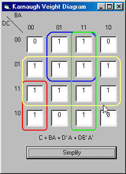



## Karnaugh Veight Diagram

### Description

The purpose of this program is to simplify a 4-variable Karnaugh-diagram.
 
### More Info
 
just put the values '1','0' or 'X' in the KV-diagram. For an unknown value 'X' or another non-numeric symbol can be used.

a KV-diagram is used is electronics to simplify boolean logic equations. This program is only intended for people who know a bit about boolean logic equations or people who want to start using them.

The simpelest equation of the KV-diagram

none encountered, but report if you find one so I can fix it. Thx

             |
---                |---
**Submitted On**   |2002-06-03 12:01:32
**By**             |[Jolly Roger](https://github.com/Planet-Source-Code/PSCIndex/blob/master/ByAuthor/jolly-roger.md)
**Level**          |Intermediate
**User Rating**    |5.0 (10 globes from 2 users)
**Compatibility**  |VB 6\.0
**Category**       |[Complete Applications](https://github.com/Planet-Source-Code/PSCIndex/blob/master/ByCategory/complete-applications__1-27.md)
**World**          |[Visual Basic](https://github.com/Planet-Source-Code/PSCIndex/blob/master/ByWorld/visual-basic.md)
**Archive File**   |[Karnaugh\_V89531632002\.zip](https://github.com/Planet-Source-Code/jolly-roger-karnaugh-veight-diagram__1-35427/archive/master.zip)

